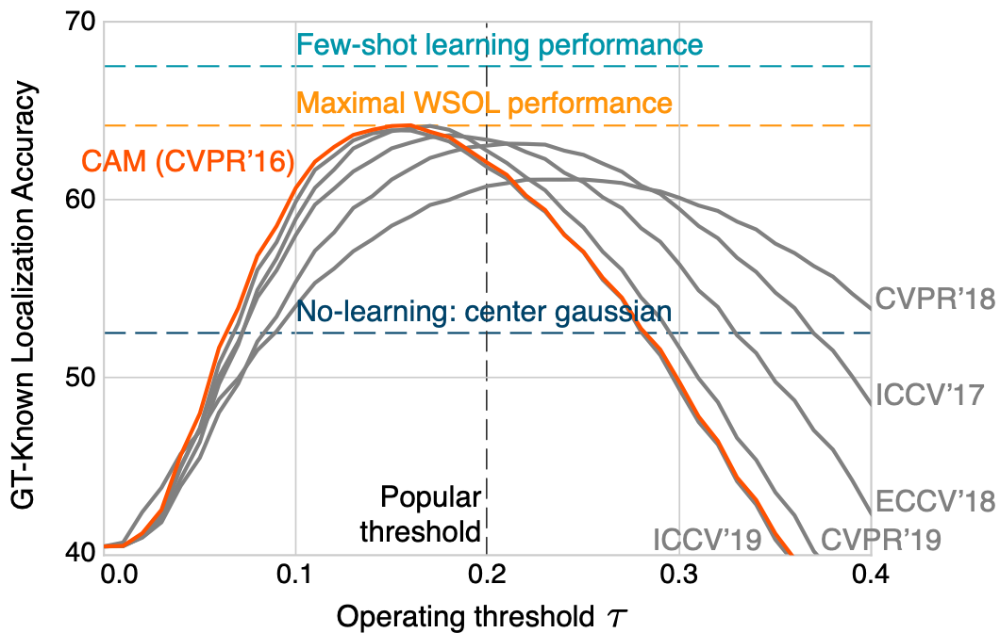
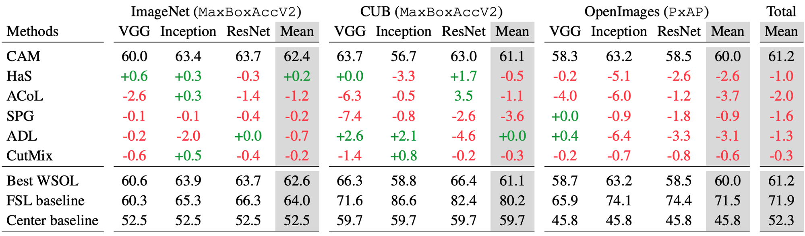

## Evaluating Weakly Supervised Object Localization Methods Right (CVPR 2020)

[CVPR 2020 paper](https://arxiv.org/abs/2001.07437) | [Journal submission](https://arxiv.org/abs/2007.04178)

Junsuk Choe<sup>1,3*</sup>, Seong Joon Oh<sup>2*</sup>, Seungho Lee<sup>1</sup>, 
Sanghyuk Chun<sup>3</sup>, Zeynep Akata<sup>4</sup>, Hyunjung Shim<sup>1</sup>  
<sub>\* Equal contribution</sub>


<sup>1</sup> <sub>School of Integrated Technology, Yonsei University</sub>  
<sup>2</sup> <sub>Clova AI Research, LINE Plus Corp.</sub>
<sup>3</sup> <sub>Clova AI Research, NAVER Corp.</sub>
<sup>4</sup> <sub>University of T&uuml;bingen</sub>

Weakly-supervised object localization (WSOL) has gained popularity over the 
last years for its promise to train localization models with only image-level 
labels. Since the seminal WSOL work of class activation mapping (CAM), 
the field has focused on how to expand the attention regions to cover objects 
more broadly and localize them better. However, these strategies rely on 
full localization supervision to validate hyperparameters and for model 
selection, which is in principle prohibited under the WSOL setup. In this paper,
 we argue that WSOL task is ill-posed with only image-level labels, and 
 propose a new evaluation protocol where full supervision is limited to only 
 a small held-out set not overlapping with the test set. We observe that, 
 under our protocol, the five most recent WSOL methods have not made a major 
 improvement over the CAM baseline. Moreover, we report that existing WSOL 
 methods have not reached the few-shot learning baseline, where the 
 full-supervision at validation time is used for model training instead. 
 Based on our findings, we discuss some future directions for WSOL.

</img>

__Overview of WSOL performances 2016-2019.__ Above image shows that recent improvements in WSOL are 
illusory due to (1) different amount of implicit full supervision through 
validation and (2) a fixed score-map threshold to generate object boxes. Under 
our evaluation protocol with the same validation set sizes and oracle threshold 
for each method, CAM is still the best. In fact, our few-shot learning baseline, 
i.e., using the validation supervision (10 samples/class) at training time, 
outperforms existing WSOL methods.

## Updates

- __9 Jul, 2020__: [Journal submission](https://arxiv.org/abs/2007.04178) available.
- __27 Mar, 2020__: [New WSOL evaluations](#5-library-of-wsol-methods) with `MaxBoxAccV2` are added.
- __28 Feb, 2020__: [New box evaluation](#improved-box-evaluation) (`MaxBoxAccV2`) is available.
- __22 Jan, 2020__: Initial upload.


## Table of contents 

* [1. Our dataset contribution](#1-our-dataset-contribution)
    + [The dataset splits](#the-dataset-splits)
* [2. Dataset downloading and license](#2-dataset-downloading-and-license)
    + [ImageNetV2](#imagenetv2)
    + [CUBV2](#cubv2)
    + [OpenImages30k](#openimages30k)
    + [Dataset statistics](#dataset-statistics)
    + [Licenses](#licenses)
* [3. Code dependencies](#3-code-dependencies)
* [4. WSOL evaluation](#4-wsol-evaluation)
    + [Prepare evaluation data](#prepare-evaluation-data)
    + [Prepare heatmaps to evaluate](#prepare-heatmaps-to-evaluate)
    + [Evaluate your heatmaps](#evaluate-your-heatmaps)
    + [Testing the evaluation code](#testing-the-evaluation-code)
* [5. Library of WSOL methods](#5-library-of-wsol-methods)
* [6. WSOL training and evaluation](#6-wsol-training-and-evaluation)
    + [Prepare train+eval datasets](#prepare-traineval-datasets)
        - [ImageNet](#imagenet)
        - [CUB](#cub)
        - [OpenImages](#openimages)
    + [Run train+eval](#run-traineval)
    + [Improved box evaluation](#improved-box-evaluation)
* [7. Code license](#7-code-license)
* [8. How to cite](#8-how-to-cite)

## 1. Our dataset contribution

WSOL is an ill-posed problem when only image-level labels are available (see paper for an argument).
To be able to solve the WSOL task, certain amount of full supervision is inevitable, and prior WSOL approaches have utilized
different amount of implicit and explicit full supervision (usually through validation).
We propose to use a fixed amount of full supervision per method by carefully designing validation splits (called `train-fullsup` in the paper), such that different methods use the same amount of localization-labelled validation split.

In this section, we explain how each dataset is split, and introduce our data contributions (image collections and new annotations) on the way.

### The dataset splits

split           | ImageNet               | CUB                        | OpenImages
----------------|------------------------|----------------------------|---------------------------
`train-weaksup` | ImageNet "train"       | CUB-200-2011 "train"       | OpenImages30k "train"  
`train-fullsup` | ImageNetV2              | CUBV2    | OpenImages30k "val"  
`test`          | ImageNet "val"         | CUB-200-2011 "test"        | OpenImages30k "test"  


We propose three disjoint splits for every dataset: `train-weaksup`, 
`train-fullsup`, and `test`. The `train-weaksup` contains images with weak 
supervision (the image-level labels). The `train-fullsup` contains images with 
full supervision (either bounding box or binary mask). It is left as freedom for 
the user to utilize it for hyperparameter search, model selection, ablative 
studies, or even model fitting. The `test` split contains images with full 
supervision; it must be used only for the final performance report. For 
example, checking the `test` results multiple times with different model 
configurations violates the protocol as the learner implicitly uses more full 
supervision than allowed. The splits and their roles are more extensively explained
in the paper.

- ImageNet
  - "train" and "val" splits of original [ImageNet](http://www.image-net.org/) 
  are treated as our `train-weaksup` and `test`. 
  - [ImageNetV2](https://github.com/modestyachts/ImageNetV2) is treated as our 
  `train-fullsup`. Note that we have annotated bounding boxes on ImageNetV2. 
- CUB
  - "train" and "test" splits of original 
  [CUB-200-2011](http://www.vision.caltech.edu/visipedia/CUB-200-2011.html) are 
  treated as our `train-weaksup` and `test`.
  - We contribute images and annotations that are similar as the original CUB, 
  namely CUBV2.
- OpenImages
  - We curate the existing [OpenImagesV5](https://storage.googleapis.com/openimages/web/index.html) 
  for the task of WSOL.
  - We have randomly selected images from the original "train", "val", and 
  "test" splits of the instance segmentation subset.

## 2. Dataset downloading and license

For original ImageNet and CUB datasets, please follow the common procedure to 
download the datasets. In this section, we only explain how to obtain the less used 
(or never used before) datasets. We also provide the license status for each dataset.
This section is for those who are interested in the full data for each dataset.
If the aim is to utilize the data for WSOL evaluation and/or training, please follow the links below:

* [Evaluation only](#prepare-evaluation-data)
* [Training + evaluation](#prepare-traineval-datasets)

#### ImageNetV2
[Download images](https://s3-us-west-2.amazonaws.com/imagenetv2public/imagenetv2-threshold0.7.tar.gz)

We utilize 10,000 images in the `Threshold0.7` split of 
[ImageNetV2](https://github.com/modestyachts/ImageNetV2) for our `train-fullsup` 
split. We have annotated bounding boxes on those images. 
Box labels exist in [here](release/) and are licensed by NAVERCorp. under
[Attribution 2.0 Generic (CC-BY-2.0)](https://creativecommons.org/licenses/by/2.0/).

#### CUBV2
[Download images](https://drive.google.com/open?id=1U6cwKHS65wayT9FFvoLIA8cn1k0Ot2M1) 

We have collected and annotated CUBV2 on our own as the `train-fullsup` split.
We have ensured that the data distribution
follows the original CUB dataset and there is no duplicate image.
We have collected 5 images per class 
(1,000 images total) from [Flickr](https://www.flickr.com/). 
Box labels and license files of all images exist in [here](release/). 
Both class and box labels are licensed by NAVERCorp under
[Attribution 2.0 Generic (CC-BY-2.0)](https://creativecommons.org/licenses/by/2.0/).

#### OpenImages30k
[Download images](https://drive.google.com/open?id=1oOb4WQ-lb8SYppHEg3lWnpHk1X8WVO4e)   
[Download segmentation masks](https://drive.google.com/open?id=1eu1YvcZlsEalhXTS_5Ni5tkImCliIPie)

The WSOL community has relied on ImageNet and CUB datasets at least for the last three years.
It is perhaps time for us to move on. We provide a WSOL benchmark based on the OpenImages30k
dataset to provide a new perspective on the generalizability of 
WSOL methods in the past and future. To make it suitable for the WSOL task, 
we use 100 classes to ensure the minimum number of single-class samples for 
each class. We have randomly selected 29,819, 2,500, and 5,000 images from the 
original "train", "val", and "test" splits of 
[OpenImagesV5](https://storage.googleapis.com/openimages/web/index.html).
Corresponding metadata can be found in [here](metadata/OpenImages/).
The annotations are licensed by Google LLC under 
[Attribution 4.0 International (CC-BY-4.0)](https://creativecommons.org/licenses/by/4.0/).
The images are listed as having a 
[Attribution 2.0 Generic (CC-BY-2.0)](https://creativecommons.org/licenses/by/2.0/).

#### Dataset statistics
Below tables summarizes dataset statistics of each split.

\# images\/classes | ImageNet  <sub>1,000 classes</sub> | CUB  <sub>200 classes</sub> | OpenImages  <sub>100 classes</sub>
-------------------|----------|-----|------------
`train-weaksup`    | ~1,200   | ~30 | ~300
`train-fullsup`    | 10       | ~5  | 25
`test`             | 10       | ~29 | 50

#### Licenses 

The licenses corresponding to our dataset contribution are summarized as follows

Dataset    | Images                                   | Class Annotations | Localization Annotations
-----------|------------------------------------------|-------------------|----------------
ImageNetV2 | See the [original Github](https://github.com/modestyachts/ImageNetV2) |  See the [original Github](https://github.com/modestyachts/ImageNetV2)  | CC-BY-2.0 NaverCorp.
CUBV2      | Follows original image licenses. See [here](release/CUBV2_image_licenses.txt). | CC-BY-2.0 NaverCorp. | CC-BY-2.0 NaverCorp.
OpenImages | CC-BY-2.0 (Follows original image licenses. See [here](https://storage.googleapis.com/openimages/web/factsfigures.html)) | CC-BY-4.0 Google LLC | CC-BY-4.0 Google LLC

Detailed license files are summarized in the [release](release) directory.  

**Note**: At the time of collection, images were marked as being licensed under 
the following licenses:
```
Attribution-NonCommercial License
Attribution License
Public Domain Dedication (CC0)
Public Domain Mark
```
However, we make no representations or warranties regarding the license status 
of each image. You should verify the license for each image yourself.


## 3. Code dependencies

Both the [evaluation-only](#4-wsol-evaluation) and [eval+train](#6-wsol-training-and-evaluation) scripts require only the following libraries: 
* [OpenCV](https://opencv.org/)
* [PyTorch](https://pytorch.org/)
* [munch](https://github.com/Infinidat/munch)

`pip freeze` returns the version information as below:
```
munch==2.5.0
numpy==1.18.1
opencv-python==4.1.2.30
Pillow==7.0.0
six==1.14.0
torch==1.4.0
torchvision==0.5.0
```

## 4. WSOL evaluation

We support evaluation of weakly-supervised object localization (WSOL) methods 
on CUB, ImageNet, and OpenImages. The main script for evaluation is 
[evaluation.py](evaluation.py). We will show how to download the `train-fullsup` 
(validation) and `test` set images and localization annotations.
An example evaluation script will be provided. 

#### Prepare evaluation data

WSOL evaluation data consist of images and corresponding localization ground 
truths. On CUB and ImageNet, they are given as boxes, and on OpenImages, they 
are given as binary masks. 

To prepare evaluation data, first, download ImageNet "val" split from 
[here](http://www.image-net.org/) and put the downloaded file on 
`dataset/ILSVRC2012_img_val.tar`.
 
Then, run the following command
```bash
./dataset/prepare_evaluation_data.sh
```

The script will download the `train-fullsup` (validation) and `test` images at 
[dataset](dataset). Metadata and box annotations already exist in this repository 
under [metadata](metadata). OpenImages mask annotations are also downloaded by 
the above script, and will be saved under [dataset](dataset) with the images.
 
The structure of image files looks like
```
dataset
└── ILSVRC
    └── val2
        └── 0
            ├── 0.jpeg
            ├── 1.jpeg
            └── ...
        └── 1
        └── ...
    └── val
        ├── ILSVRC2012_val_00000001.JPEG
        ├── ILSVRC2012_val_00000002.JPEG
        └── ...
└── CUB
    └── 001.Black_footed_Albatross
        ├── Black_Footed_Albatross_0046_18.jpg
        ├── Black_Footed_Albatross_0002_55.jpg
        └── ...
    └── 002.Laysan_Albatross
    └── ...
└── OpenImages
    └── val
        └── 0bt_c3
            ├── 1cd9ac0169ec7df0.jpg
            ├── 1cd9ac0169ec7df0_ignore.png
            ├── 1cd9ac0169ec7df0_m0bt_c3_6932e993.png
            └── ...
        └── 0bt9lr
        └── ...
    └── test   
        └── 0bt_c3
            ├── 0a51958fcd523ae4.jpg
            ├── 0a51958fcd523ae4_ignore.png
            ├── 0a51958fcd523ae4_m0bt_c3_41344f12.png
            ├── 0a51958fcd523ae4_m0bt_c3_48f37c0f.png
            └── ...
        └── 0bt9lr
        └── ...
```

#### Prepare heatmaps to evaluate

Our WSOL evaluation evaluates heatmaps of the same width and height as the input 
images. The evaluation script requires the heatmaps to meet the following 
criteria:

1. Heatmap file structure.
  - Heatmaps shall be located at the user-defined `<heatmap_root>`.
  - `<heatmap_root>` folder contains the heatmap files with the file names dictated by the `metadata/<dataset>/<split>/image_ids.txt` files.
  - If an `image_id` has slashes (`/`), e.g. `val2/995/0.jpeg`, then the corresponding heatmaps shall be located at the corresponding sub-directories, e.g. `<heatmap_root>/val2/995/0.npy`.

2. Heatmap data type.
  - Each heatmap file should be a `.npy` file that can be loaded as a numpy array with `numpy.load()`.
  - The array shall be two-dimensional array of shape `(height, width)`, same as the input image sizes.
  - The array shall be of type `np.float`.
  - The array values must be between 0 and 1.
  
#### Evaluate your heatmaps

We support three datasets, CUB, ImageNet, and OpenImages. 

On CUB and ImageNet, we evaluate the `MaxBoxAcc`, the maximal box accuracy at 
the optimal heatmap threshold, where the box accuracy is measured by the ratio 
of images where the box generated from the heatmap overlaps with the ground 
truth box with IoU at least `0.5`. Please see the code and paper for the full 
details.

On OpenImages, we evaluate the `PxAP`, pixel average precision. We generate 
the pixel-wise precision-recall curve, and compute the area under the curve. 
Please see the code and paper for the full details. 

We present an example call to the evaluation API below:
```bash
python evaluation.py --scoremap_root=train_log/scoremaps/ \
                     --metadata_root=metadata/ \
                     --mask_root=dataset/ \
                     --dataset_name=CUB \
                     --split=val \
                     --cam_curve_interval=0.01
```

When `CUB` evaluation data are downloaded at `dataset` using our download script 
above, and the corresponding heatmaps are saved under `train_log/scoremaps/`, 
then the `MaxBoxAcc` will be evaluated as a result of this call.

#### Testing the evaluation code

The test code for the evaluation modules is given at 
[evaluation_test.py](evaluation_test.py). The unit tests ensure the correctness 
of the evaluation logic, and potentially prevents unnoticed changes in the 
functionalities of underlying libraries (e.g. OpenCV, Numpy).
To run the unit test, run
```bash
nosetests
```
`pip3 install nose` may be required to install [nose](https://nose.readthedocs.io/).

## 5. Library of WSOL methods

We support the training and evaluation of the following weakly-supervised object 
localization (WSOL) methods. Our implementation of the methods can be found in 
the [wsol](wsol) folder. Please add your own WSOL method in the list by making 
a pull request.

We provide the full training and evaluation scripts on the provided WSOL methods. 
Details will be explained in the [next section](#6-wsol-training-and-evaluation).

Method | Paper | Original code
-- | -- | --
Class-Activation Mapping (CAM) | [CVPR'16](http://cnnlocalization.csail.mit.edu/Zhou_Learning_Deep_Features_CVPR_2016_paper.pdf) | [Code](https://github.com/metalbubble/CAM)
Hide-and-Seek (HaS) | [ICCV'17](http://krsingh.cs.ucdavis.edu/krishna_files/papers/hide_and_seek/my_files/iccv2017.pdf) | [Code](http://krsingh.cs.ucdavis.edu/krishna_files/papers/hide_and_seek/hide_seek.html)
Adversarial Complementary Learning (ACoL) | [CVPR'18](http://openaccess.thecvf.com/content_cvpr_2018/papers/Zhang_Adversarial_Complementary_Learning_CVPR_2018_paper.pdf) | [Code](https://github.com/xiaomengyc/ACoL)
Self-Produced Guidance (SPG) | [ECCV'18](http://openaccess.thecvf.com/content_ECCV_2018/papers/Xiaolin_Zhang_Self-produced_Guidance_for_ECCV_2018_paper.pdf) | [Code](https://github.com/xiaomengyc/SPG)
Attention-based Dropout Layer (ADL) | [CVPR'19](http://openaccess.thecvf.com/content_CVPR_2019/papers/Choe_Attention-Based_Dropout_Layer_for_Weakly_Supervised_Object_Localization_CVPR_2019_paper.pdf) | [Code](https://github.com/junsukchoe/ADL)
CutMix | [ICCV'19](http://openaccess.thecvf.com/content_ICCV_2019/papers/Yun_CutMix_Regularization_Strategy_to_Train_Strong_Classifiers_With_Localizable_Features_ICCV_2019_paper.pdf) | [Code](https://github.com/clovaai/CutMix-PyTorch)

</img>

__Evaluation of WSOL methods.__ How much have WSOL methods improved upon the vanilla CAM 
model? `MaxBoxAccV2` and `PxAP` performances over the `test` split are shown, relative to the vanilla CAM performance. 
We recommend the `MaxBoxAccV2` over the original box metric `MaxBoxAcc` used in the CVPR version.
For details, see the [latest arXiv version](https://arxiv.org/abs/2001.07437).
Hyperparameters have been optimized over the identical `train-fullsup` split for 
all WSOL methods and the FSL baseline: (10,5,5) full supervision/class for 
(ImageNet,CUB,OpenImages). Note that we evaluate the last checkpoint of each 
training session. More detailed results and corresponding hyperparameter sets 
are available at 
[here](https://docs.google.com/spreadsheets/d/1O4gu69FOOooPoTTtAEmFdfjs2K0EtFneYWQFk8rNqzw/edit?usp=sharing).


## 6. WSOL training and evaluation

We describe the data preparation and training scripts for the above six prior 
WSOL methods.

### Prepare train+eval datasets

Our repository enables evaluation _and_ training of WSOL methods on two 
commonly-used benchmarks, CUB and ImageNet, and our newly-introduced benchmark 
OpenImages. We describe below how to prepare those datasets.

#### ImageNet

Both the original [ImageNet](http://www.image-net.org/) and 
[ImageNetV2](https://github.com/modestyachts/ImageNetV2) are required for WSOL 
training. Note that "val" split of the original ImageNet is considered as `test` 
split, and ImageNetV2 is used for  split (`train-fullsup`) in our framework. 
 
To prepare ImageNet data, download ImageNet "train" and "val" splits from 
[here](http://www.image-net.org/) and put the downloaded file on 
`dataset/ILSVRC2012_img_train.tar` and `dataset/ILSVRC2012_img_val.tar`.

Then, run the following command on `root` directory to extract the images. 
```
./dataset/prepare_imagenet.sh
```
`apt-get install parallel` may be required to install [parallel](https://www.gnu.org/software/parallel/).

The structure of image files looks like
```
dataset
└── ILSVRC
    └── train
        └── n01440764
            ├── n01440764_10026.JPEG
            ├── n01440764_10027.JPEG
            └── ...
        └── n01443537
        └── ...
    └── val2
        └── 0
            ├── 0.jpeg
            ├── 1.jpeg
            └── ...
        └── 1
        └── ...
    └── val
        ├── ILSVRC2012_val_00000001.JPEG
        ├── ILSVRC2012_val_00000002.JPEG
        └── ...
```
Corresponding annotation files can be found in [here](metadata/ILSVRC).

#### CUB

Both the original 
[CUB-200-2011](http://www.vision.caltech.edu/visipedia/CUB-200-2011.html) 
and our CUBV2 datasets are required for WSOL training. Note that CUBV2 is 
considered as a validation split (`train-fullsup`). Then, run the following 
command to download original CUB dataset and extract the image files on `root` 
directory.

```
./dataset/prepare_cub.sh
```

Note: you can also download the CUBV2 dataset from 
[here](https://drive.google.com/open?id=1U6cwKHS65wayT9FFvoLIA8cn1k0Ot2M1). Put 
the downloaded file on `dataset/CUBV2.tar` directory and then run the above script.

The structure of image files looks like
```
dataset
└── CUB
    └── 001.Black_footed_Albatross
        ├── Black_Footed_Albatross_0001_796111.jpg
        ├── Black_Footed_Albatross_0002_55.jpg
        └── ...
    └── 002.Laysan_Albatross
    └── ...
```
Corresponding annotation files can be found in [here](metadata/CUB).


#### OpenImages

We provide a new WSOL benchmark, OpenImages30k, 
based on [OpenImagesV5](https://storage.googleapis.com/openimages/web/index.html). 

To download and extract files, run the following command on `root` directory

```
./dataset/prepare_openimages.sh
```

Note: you can also download the OpenImages30k dataset from here 
([images](https://drive.google.com/open?id=1oOb4WQ-lb8SYppHEg3lWnpHk1X8WVO4e)
, [masks](https://drive.google.com/open?id=1eu1YvcZlsEalhXTS_5Ni5tkImCliIPie)).
Put the downloaded `OpenImages_images.zip` and `OpenImages_annotations.zip` 
files in `dataset` directory and run the above script.

The structure of image files looks like:
```
dataset
└── OpenImages
    └── train
        └── 0bt_c3
            ├── 0a9b7df4d832baf7.jpg
            ├── 0abee225b2418fe7.jpg
            └── ...
        └── 0bt9lr
        └── ...
    └── val
        └── 0bt_c3
            ├── 1cd9ac0169ec7df0.jpg
            ├── 1cd9ac0169ec7df0_ignore.png
            ├── 1cd9ac0169ec7df0_m0bt_c3_6932e993.png
            └── ...
        └── 0bt9lr
        └── ...
    └── test   
        └── 0bt_c3
            ├── 0a51958fcd523ae4.jpg
            ├── 0a51958fcd523ae4_ignore.png
            ├── 0a51958fcd523ae4_m0bt_c3_41344f12.png
            ├── 0a51958fcd523ae4_m0bt_c3_48f37c0f.png
            └── ...
        └── 0bt9lr
        └── ...
```

Corresponding annotation files can be found in [here](metadata/OpenImages). 

### Run train+eval

We support the following architecture and method combinations:

* Architectures.
  - `vgg16`
  - `inception_v3`
  - `resnet50`
  
* Methods (see [Library of WSOL methods](#5-library-of-wsol-methods) and paper for descriptions).
  - `cam`
  - `has`
  - `acol`
  - `spg`
  - `adl`
  - `cutmix`

Below is an example command line for the train+eval script.
```bash
python main.py --dataset_name OpenImages \
               --architecture vgg16 \
               --wsol_method cam \
               --experiment_name OpenImages_vgg16_CAM \
               --pretrained TRUE \
               --num_val_sample_per_class 5 \
               --large_feature_map FALSE \
               --batch_size 32 \
               --epochs 10 \
               --lr 0.00227913316 \
               --lr_decay_frequency 3 \
               --weight_decay 5.00E-04 \
               --override_cache FALSE \
               --workers 4 \
               --box_v2_metric True \
               --iou_threshold_list 30 50 70 \
               --eval_checkpoint_type last
```

See [config.py](config.py) for the full descriptions of the arguments, especially 
the method-specific hyperparameters.

During training, we evaluate the model on `train-fullsup` split at every epoch and 
save a checkpoint (`best_checkpoint.pth.tar`) if the localization performance 
surpasses every previous score. We also save last checkpoint 
(`last_checkpoint.pth.tar`) when the training is finished. You can select 
checkpoint type for evaluation on `test` split by setting `eval_checkpoint_type` 
argument accordingly. We suggest to use the last checkpoint for evaluation.

### Improved box evaluation

We introduce an improved box evaluation metric, `MaxBoxAccV2`, over the original metric used in the CVPR version: `MaxBoxAcc`. 
Key improvements are as follows:

+ Box evaluation using multiple IoU thresholds (default: 30%, 50%, 70%). 
If you set `multi_iou_eval` to `True` (default), the `localization` metric in the 
log shows a mean of `MaxBoxAcc` across all IoU thresholds. Otherwise, it only shows 
`MaxBoxAcc` at 50% IoU threshold. The IoU threshold list can be easily set by 
changing `iou_threshold_list` argument. 

+ A new advanced bounding box mining scheme. Bounding boxes are extracted from 
all contours in the thresholded score map. You can use this feature by setting 
`multi_contour_eval` to `True` (default). Otherwise, bounding boxes are extracted 
from the largest connected component of the score map.

**We recommend for future researchers to use the `MaxBoxAccV2` metric for box-based evaluation.**
Users can evaluate the WSOL methods with this metric by setting `box_v2_metric` to `True`.

## 7. Code license

This project is distributed under MIT license.

```
Copyright (c) 2020-present NAVER Corp.
Permission is hereby granted, free of charge, to any person obtaining a copy
of this software and associated documentation files (the "Software"), to deal
in the Software without restriction, including without limitation the rights
to use, copy, modify, merge, publish, distribute, sublicense, and/or sell
copies of the Software, and to permit persons to whom the Software is
furnished to do so, subject to the following conditions:
The above copyright notice and this permission notice shall be included in all
copies or substantial portions of the Software.
THE SOFTWARE IS PROVIDED "AS IS", WITHOUT WARRANTY OF ANY KIND, EXPRESS OR
IMPLIED, INCLUDING BUT NOT LIMITED TO THE WARRANTIES OF MERCHANTABILITY,
FITNESS FOR A PARTICULAR PURPOSE AND NONINFRINGEMENT. IN NO EVENT SHALL THE
AUTHORS OR COPYRIGHT HOLDERS BE LIABLE FOR ANY CLAIM, DAMAGES OR OTHER
LIABILITY, WHETHER IN AN ACTION OF CONTRACT, TORT OR OTHERWISE, ARISING FROM,
OUT OF OR IN CONNECTION WITH THE SOFTWARE OR THE USE OR OTHER DEALINGS IN THE
SOFTWARE.
```

## 8. How to cite

```
@inproceedings{choe2020cvpr,
  title={Evaluating Weakly Supervised Object Localization Methods Right},
  author={Choe, Junsuk and Oh, Seong Joon and Lee, Seungho and Chun, Sanghyuk and Akata, Zeynep and Shim, Hyunjung},
  year = {2020},
  booktitle = {Conference on Computer Vision and Pattern Recognition (CVPR)},
  note = {to appear},
  pubstate = {published},
  tppubtype = {inproceedings}
}
```
```
@article{wsol_eval_journal_submission,
  title={Evaluation for Weakly Supervised Object Localization: Protocol, Metrics, and Datasets},
  author={Choe, Junsuk and Oh, Seong Joon and Chun, Sanghyuk and Akata, Zeynep and Shim, Hyunjung},
  journal={arXiv preprint arXiv:2007.04178},
  year={2020}
}
```
